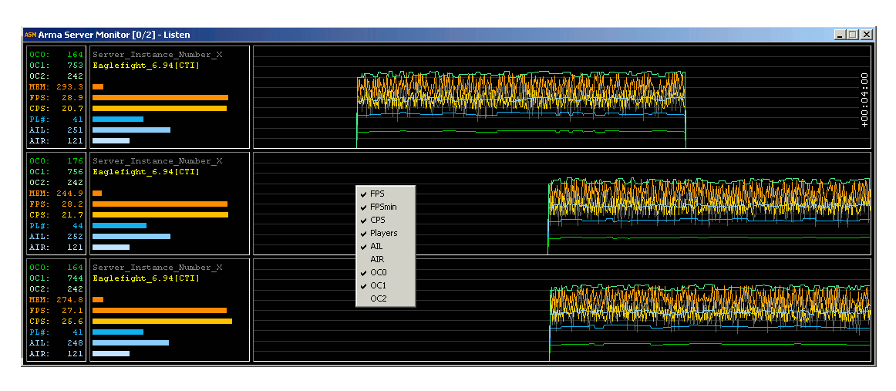

#Arma Server Monitor#

"Arma Server Monitor" is originally a spin-off of my experiments with the arma engine.

----------

Propertys:

	- monitors up to 4 server (or headless client) instances simultaneous 
	- introduces a performance value CPS for FSM processing analysis
	- very simple, compact and solid design
	- almost no influence to cpu load
	- easy to use (mini addon)
	- customizable, moveable history graphs, up to 24h record to RAM (ringbuffer)
	- logs to text file, individual for each instance, mission, interval configurable  	

----------

Currently able to monitor the following values:

	- OC[0..2] three independent, customizable "counter" (.sqf based)  
	- PL# Number of alive player units
	- AIL Number of alive server local AI units
	- AIR Number of alive AI units on connected machines (remote)
	- FPS (on a server this means simulation cycles per second)
	- FPSmin (the minimum FPS of the last 16 cycles, hist. graph only)
	- CPS Condition-evaluation per Second (rel. to AI response delay, VM load)
	- MEM Amount of allocated physical memory
	- NTI Network Traffic Incoming [kByte/s]
	- NTO Network Traffic Outgoing [kByte/s]
	- DIR DIsk Read [kByte/s]
	- Name of the currently played mission (missionName)
	- Name of the instance profile (profileName)

----------

**Arma Server Monitor** consists of 3 components:

	fn_ASM.fsm 				- Reports some internal performance states from arma server (or HC)
	ASMdll.dll 				- Interfaces to ArmaServerMonitor.exe via shared memory (MMF)
	ArmaServerMonitor.exe 	- The Monitor itself reads from MMF and displays the values
	
-------

This tool can be very helpful to monitor your server under load, to spot bad coded parts in your mission/mod.    
It will give you an impression, how well your server/mission scale with player/AI/object numbers.

Additional to the history graph of FPS value, now the value **FPSmin** is drawed as a graph.   
By watching this graphs, you can **easily spot lags** on your server, without being in game.

Alongside to the well known FPS (frames per second), an very interesting value, **CPS**, is introduced here.    
**CPS** is expressed by **condition** **evalations** per **second** and measured from an reference condition in `fn_ASM.fsm`.    
You can realize this **CPS** value as the reciprocal of the current "minimal response delay" of local AI in the running mission.    

You can now watch up to three different number values, returned by free configurable .sqf code pieces.   
To enable this counters, set **objectcountintervalX** in asm.ini to a value > 0 [sec] and add an .sqf code string to     
**objectcountcommandX** entry in asm.ini (see example). By watching the number of several mission-objects via **OCX**,    
you can check if your cleanup-routine is working well and what objects are loading your server.     

example **asm.ini** (default):

    [ASM]
    enableAPImonitoring=1
    objectcountinterval0=30
    objectcountinterval1=60
    objectcountinterval2=0
    objectcountcommand0=count entities ""All"";
    objectcountcommand1=count vehicles;
    objectcountcommand2=count allMissionObjects ""All"";

----------

**How to use ASM:**

Extract this file: [https://github.com/fred41/ASM/blob/master/addon/ASM.zip](https://github.com/fred41/ASM/blob/master/addon/ASM.zip)    to your Arma 3 root folder.

Add **-mod=@ASM** to your server (or HC) launch params.     

Run `ArmaServerMonitor.exe` from what directory you want, to monitor all your server (or HC) instances locally.

Additional, it is possible to **connect** to `Arma Server Monitor` **from remote** via TCP.   
To watch your server from a remote device, you need an ASM instance on that device too and to configure it per start params as client.     
Default start params for `ArmaServerMonitor.exe` are: `-server -n1 -h127.0.0.1 -p24000`   
This means, ASM starts as monitoring server and listens at TCP port 24000, max. allowed remote clients = 1.

Example for client configuration: `ArmaServerMonitor.exe -client -h201.178.1.102 -p24000`

ASM starts as client and tries periodical to connect/read to/from your ASM  server at `201.178.1.102:24000`.   
If your server is firewall protected, you have to open the selected TCP port on server.

You can activate the **optional log feature**, by adding -lfilenameprefix to your ASM start line.   
By adding a -tinterval you can select the log interval in seconds (default 1).
Values are ordered like this:

**TimeStamp|FPS|CPS|PL#|AIL|AIR|OC0|OC1|OC2**

To support monitors of different width, there is a **-wxxx** command line parameter, to set the width of the history graph in pixels/seconds.     
This value should be set to a multiple of 60, or better of 300. Default is 900 pixels (**-w900**).   
   
---
**command line params**:    

	s   configure ASM as server (-s, default)
	n   allow n clients to connect (-n1, default)
	c   configure ASM as client (-c)
	h	hostaddress to bind or to connect to (-h127.0.0.1, default)	
	p	port to listen or to connect to (-p24000, default)
	l   prefix for and activation of logfile (-lASMlog)
	t   interval for logging in seconds(-t1, default)
	w	width of historygraph in pixels/samples (-w900, default)
	b	enable bolder history graph lines, larger font for variables (-b)
	o	incase you want to run more then 4 instances, range 0..3, (-o0, default)  

---

Use RMB over value/progressbar area to configure user interface (popup menu).   
Use RMB over the history graphs, to configure the visibility of individual graphs (popup menu).   
Use LMB on history graph to adjust the offset in 24h ringbuffer, double click resets offset to zero.   

---

**If you prefer to run your DS instance(s) as service, you have to start ASM with admin rights**     

Feel free to use the source code of ASMdll.dll, maybe as a start for your own projects.

Additional hint: to avoid @ASM listing in arma server browser, just install ASM.pbo in a3\addons folder.    

*ENJOY :)*     

---

Changelog:    
01.06.2013 Changed the install/launch method to **mini-addon** (thanks terox for inspiration)    
01.06.2013 Fixed: instance occupied additional slot at mission change    
02.06.2013 Changed bar graphs for CPS & FPS to **logarithmic scale** to show states more intuitive   
03.06.2013 Added **history graphs**, customizable (individual visibility, update interval), transparency switch    
08.06.2013 Custom build for use with DS running as service added   
11.06.2013 Fixed: AI was not counted correctly    
13.06.2013 running DS as **service** now merged in default build (custom build removed)    
17.06.2013 **remote monitoring** now available via additional ASM instance, configured per start params      
18.06.2013 Amount of allocated physical memory in [MB], **MEM** added      
04.07.2013 graphs for player number adapted from 50 to 100    
05.07.2013 history graph extd., better lag visualisation via FPSmin (popup menu)     
09.07.2013 some performance related improvements          
11.07.2013 profilName now displayed additional to missionName; forced=1 -> preInit=1 in cfgFunctions      
15.07.2013 counter for allMissionObjects added, helps to check if cleanup routines works                  
31.07.2013 object counting interval, configurable in **asm.ini** [seconds], set *objectcountinterval=0* to deactivate          
31.08.2013 userinterface improvements, use **popup-menu** to check it out (thanks zach72 for ideas)    
22.10.2013 UI settings saved/restored to/from registry at session end/start      
14.11.2013 **FPS,CPS,FPSmin** graph changed to **linear scale**, MEM bar scale to max. 4GB now    
26.11.2013 Source of ASMdll.dll published on github        
02.12.2013 historygraph extended to 86400 seconds (24h), record to RAM ringbuffer,   
hor.scroll:LMB, reset:dbl.click,   timediv. via popup menu     
06.12.2013 simple log feature added (-lfilenameprefix, -tinterval)   
08.12.2013 fix: instance slot blocked, caused by arma server crash (full update required)      
13.12.2013 three **customizable object counter** added (set interval and .sqf command in asm.ini)   
08.02.2014 variable hints, vertical grid lines and a **-w** command line switch (history width in pixels) added   
15.02.2014 'bold'mode added, use additional **-b** param in commandline to activate   
23.02.2014 sampling interval (1 second) now synced via timeGetTime(), to minimize longtime drift   
22.03.2014 added API monitored values NTI, NTO, DIR, fixed: logging continues even if mission was stopped     
04.04.2014 fixed: AIR values sometimes incorrect calculated     
26.04.2014 fixed: enableAPImonitoring causes double slot usage     
28.04.2014 fix: NTI/NTO, works now with A2 (enableAPImonitoring=2, thanks Viba, for reporting and testing)    
14.05.2014 for more then 4 instances (up to 16) a new commandline param, -o is introduced (for 4 blocks, of 4 arma server instances each)    
22.05.2014 removed old debug code from ASMdll.dll, DIR-value counting related fix    
24.05.2014 profile prefix based slot selection added    
23.07.2014 changed library name for callextension commands, in fn_ASM.fsm, to lowercase (thx Killswitch, for hint)    

     
